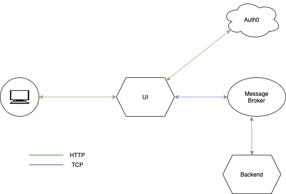

## Learning Microservices with RoR

### Problem Description

Imagine that you don't want to or just don't have enough time to go through entire Twitter timeline every day and you are only interested in URLs to the various resources that are submitted by the people you follow (e.g., to blog posts). Implement a solution that will solve this problem and will allow to specify either since when you want to fetch tweets or between what timestamps and will deliver the result via the email. Divide the solution into two Rails applications:

- Service A with UI where specify the input (i.e. timestamps but also the email address, to which the results will be delivered)

- Service B will accept the input somehow from Service A and deliver the result via email. The template for the email should be customizable (e.g. using Liquid) and the Service B should be flexible enough to handle potentially other use cases with different input. In that sense, delivering URLs from Twitter would be just one of the many types of emails that such service should be capable of handling. The template for this particular use case should include the URLs themselves, date and some info indicating what it is about (especially for shortened URLs).

### Tasks

#### Client/UI

- [ ] Setup StimulusJS, Tailwind CSS and the theme to use
- [ ] Implement authentication with Auth0 (Twitter)
- [ ] Allow user to input date and email
- [ ] Setup RabbitMQ and then publish these inputs to it

#### Backend

- [ ] Setup RabbitMQ and consume the message from publisher
- [ ] Setup twitter REST client and filter through twitter feeds to get URLs
- [ ] Create worker to send emails
